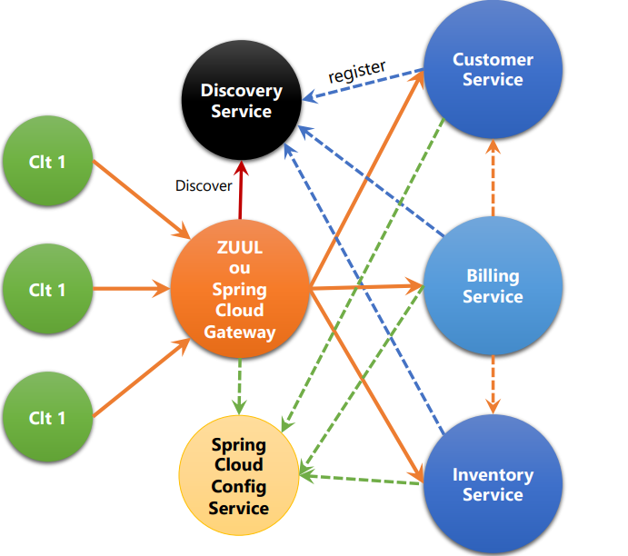
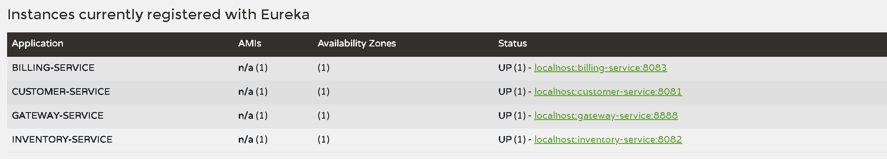
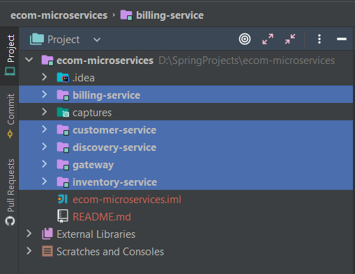
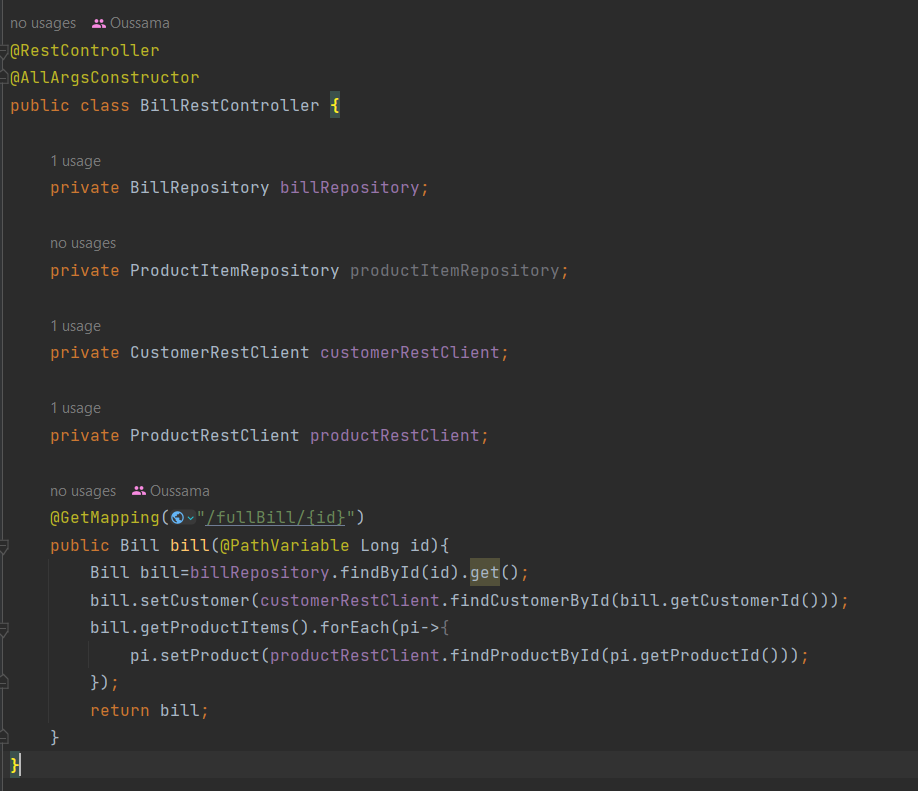
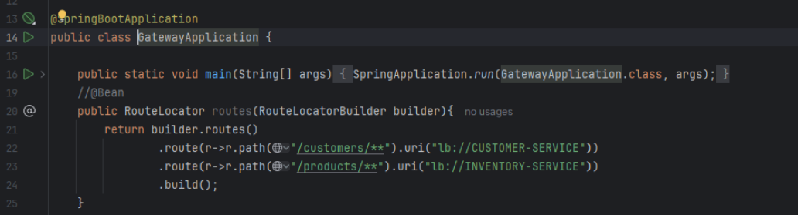
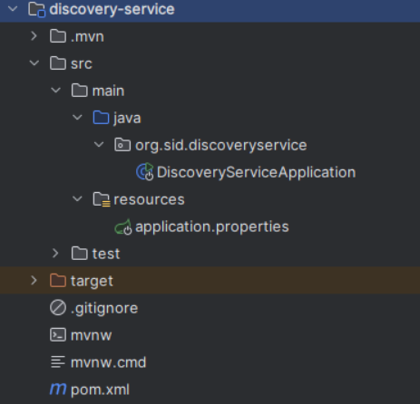
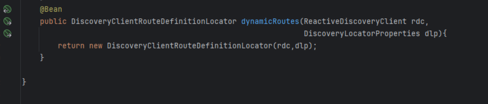

# E-COM APP

 

L'architecture technique :

 

 

Les services enregistrés dans Eureka Service :

 

 

Les microservices utilisés :

 

 

La methode RestController

Configuration statique du système de routage : 

l'annuaire Eureka Discrovery Service : 

configuration dynamique des routes de la gateway : 

